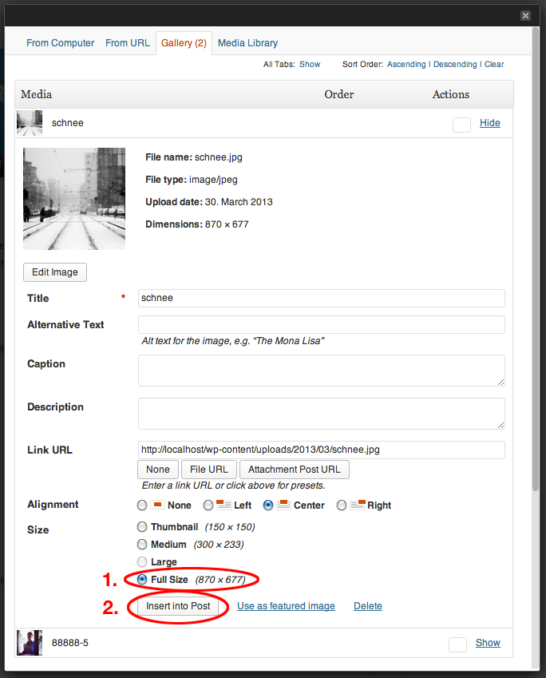
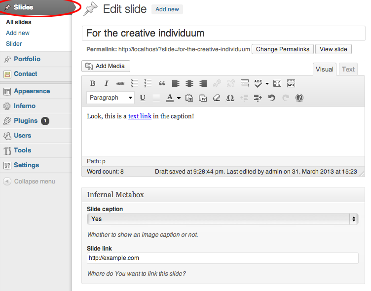
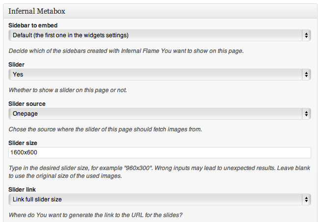

# Manual
---

## Foreword

First of all, thank You really much for using WP Inferno. We hope You will encounter as few glitches of which type ever and that You're going to build a super awesome website with the help of this plugin!

**Note:** Many issues are not really related to the plugin or the theme but actually are more WordPress related (of course, a WordPress plugin or theme is also somehow "WordPress-related" but I mean some type of basic WordPress knowledge).
So, to help us and Yourself, especially if You are a new to WordPress, please have a short look at the topics on the official [WordPress Documentation](http://codex.wordpress.org/Getting_Started_with_WordPress) and [Getting Started Guid](http://codex.wordpress.org/Getting_Started_with_WordPress). And also please don't forget to ask [Google](http://google.com).

## Installation

Installation is easy. At this moment WP Inferno is not fully Open Source and not available as a stand-alone WordPress plugin, so the only chance You are using this with a WordPress theme is You purchased one of our themes (either from [Themeforest](http://themeforest.net/user/indiapart) or from [Themedale](http://themedale.net)).
If so, the plugin is being installed the moment You activate our theme.

**Note:** The plugin is not activated for all Your themes but only for the one manufactured by us, this is Indiapart.

So, after You've installed and activated the theme, WP Inferno is installed, too. But besides of the Inferno Core no submodules are active. To activate them, go to the admin page "Inferno" linked in the main admin navigation. You should see a list of submodules and a short description to each of them. Currently, there are the following modules available:

- **Infernal Flame**: An awesome Tweaks library. Activates Widgets from other active modules, adds a bunch of highly extensive shortcodes and delivers some important code used by the other modules.
- **Infernal Portfolio**: Show Your work off with the probably most extendable and unique portfolio out there!
    - *Depends on __Infernal Flame__*
- **Infernal Slider**: If You want to use a slider somewhere on the page (either in the header or in the portfolio single views) You need to activate this.
    - *Depends on __Infernal Flame__*
- **Infernal Panel**: This is where all the custom theme magic happens. You need to activate this in any case, because this is the option panel which inherits all the theme options
- **Infernal Society**: Your social headquarter. If you plan to embed Social Icons somewhere, just add Your accounts and add them afterwards with a shortcode or a widget (for which You will need Infernal Flame, but it won't break if You don't activate Flame, so it's not a dependency)

Activate whatever You want to use. The modules are written in a unique way that for example most of JavaScript and Stylesheets which are not used though the related submodule is active *will not be used unless You explicitly build them in Your website, __which highly reduces the loading time for Your visitors__*.

## The submodules

### Infernal Panel

Infernal Panel is the core option manager for Your website. Just activate it, click on the new "Infernal Panel" link in Your WordPress admin and set the theme up like You want. We always try to make it as clear as possible what single options are affecting, and so are the descriptions for them. Also, You will find often examples and default values.

We are going to explain two special option types in the following:

#### Font option

You will recognize this type of option mostly at the "Show / hide Google Font for this option" button below. If there is no such button, the option is just a simple select menu. If the button is there and You want to use a Google Font, click on the button. You see a text field where You can type in the Google font You want to use (make sure to seek one good first at the [Google font directory](http://www.google.com/fonts/)).
Now, if You would want to use the font "Playfair Display SC", You also would have to type in exactly "Playfair Display SC" into the field. It won't work with "Playfair Display Sc", "playfair display sc" or something else, so the this option is case sensitive.

#### Image upload option

If You want to upload an image (for example Your company logo), You just have to click on the "Upload image" button, after which the well known WordPress media upload box appears. You can either chose an existing image and use it or upload a new one. At the point when You have the file details in front of You, simply use the "Full Size"-size and click on "Insert into Post". The box closes and the correct image URL of the uploaded media file is automatically inserted into the field.

**Note**: All other fields in the box do not affect this worktrough. You can have a description for that image to, an alternative text and anything else, the only things which matter is to select the proper size and to insert the URL.

### Infernal Flame

This adds many Shortcodes and Widgets to Your theme. Also, Infernal Flame allows You to create unlimited custom widget areas and use them on pages and posts (this allows You to have many *different* widget areas and not some limited site wide ones).

#### Tweaks

Just below the sidebars section on the Infernal Flame admin page You can manage some further global site tweaks (at this point only a scroll to top button).

#### Widget areas (sidebars)

Click on "Infernal Flame" in the "Inferno" area of Your admin navigation. You see an text field asking You to type in the name for a sidebar. You can chose any name, for example *Contact sidebar*. Now You have a new widget area (sidebar) in Your *Appearance* > *Widgets* site in Your admin called *Contact sidebar*. Paste there any widgets just like in every other widget area. Now, if You would go to the edit page of a fictive "Contact"-page, You are able to select a sidebar You want to embed on this specific page.
This way, You can have different widget areas for let's say Your homepage, contact page and all other pages. You can create as many sidebars in Infernal Flame as You want and have as many unique widget areas on Your WordPress pages.

**Note:** The page where You are going to embed the sidebars should have an output for a sidebar. Currently, the plugin **does not check** (and probably is never going to do so) if the page template for the specific page supports widget areas and if it does, if it supports the Infernal Flame sidebars. So You either have to try this out or to look up in the page template documentation.

#### Widgets

Infernal Flame adds following widgets to Your WordPress:

- **flickr widget**: shows a number of flickr images from a user or group.
- **recent tweets widget**: displays a number of Your latest tweets, output can be customized.
- **society widget**: outputs Your social profiles from the Infernal Society extension.
- **video widget**: displays a responsive video.

#### Shortcodes

Have a look on the basic [Shortcode introduction](http://codex.wordpress.org/Shortcode) and [Shortcode API](http://codex.wordpress.org/Shortcode_API) to see how shortcodes work. Infernal Flame adds following shortcodes to Your WordPress:

- **Structural shortcodes (all responsive with fluid width and nestable)**
    - **stacked**: This is like a simple div container thought as a row which can contain further column shortcodes like **one_half**. It will eventually add some margin and / or a dividing dash below itself, but its specific effects depend on the theme stylesheet.
        - use like *[stacked]Further content[/stacked]*
        - **Optional attributes**: 
            - border="yes|no", default: yes. Define if the container shall have a dash below itself
    - **one_half**: Devides the content in one half of the parent container width.
        - use like *[one_half]Further content[/one_half]*
        - **Optional attributes**:
            - css_class="custom-value", default: none. Add a custom css class.
    - **one_half_last**: Devides the content in one half, but has no margin on the right, which makes it perfect to be the last filling column in a row.
        - use like *[one_half_last]Further content[/one_half_last]*
        - **Optional attributes**:
            - css_class="custom-value", default: none. Add a custom css class.
    - **one_third**: Devides the content in one third of the parent container width.
        - use like *[one_third]Further content[/one_third]*
        - **Optional attributes**:
            - css_class="custom-value", default: none. Add a custom css class.
    - **two_thirds**: Devides the content in two thirds of the parent container width.
        - use like *[two_thirds]Further content[/two_thirds]*
        - **Optional attributes**:
            - css_class="custom-value", default: none. Add a custom css class.
    - **one_third_last**: Devides the content in one third of the parent container width, but has no margin on the right, which makes it perfect to be the last filling column in a row.
        - use like *[one_third_last]Further content[/one_third_last]*
        - **Optional attributes**:
            - css_class="custom-value", default: none. Add a custom css class.
    - **two_thirds_last**: Devides the content in two thirds of the parent container width, but has no margin on the right, which makes it perfect to be the last filling column in a row.
        - use like *[two_thirds_last]Further content[/two_thirds_last]*
        - **Optional attributes**:
            - css_class="custom-value", default: none. Add a custom css class.
    - **one_fourth**: Devides the content in one fourth of the parent container width.
        - use like *[one_fourth]Further content[/one_fourth]*
        - **Optional attributes**:
            - css_class="custom-value", default: none. Add a custom css class.
    - **three_fourths**: Devides the content in three fourths of the parent container width.
        - use like *[three_fourths]Further content[/three_fourths]*
        - **Optional attributes**:
            - css_class="custom-value", default: none. Add a custom css class.
    - **one_fourth_last**: Devides the content in one fourth of the parent container width, but has no margin on the right, which makes it perfect to be the last filling column in a row.
        - use like *[one_fourth_last]Further content[/one_fourth_last]*
        - **Optional attributes**:
            - css_class="custom-value", default: none. Add a custom css class.
    - **three_fourths_last**: Devides the content in three fourths of the parent container width, but has no margin on the right, which makes it perfect to be the last filling column in a row.
        - use like *[three_fourths_last]Further content[/three_fourths_last]*
        - **Optional attributes**:
            - css_class="custom-value", default: none. Add a custom css class.
    - **one_fifth**: Devides the content in one fifth of the parent container width.
        - use like *[one_fifth]Further content[/one_fifth]*
        - **Optional attributes**:
            - css_class="custom-value", default: none. Add a custom css class.
    - **two_fifths**: Devides the content in two fifths of the parent container width.
        - use like *[two_fifths]Further content[/two_fifths]*
        - **Optional attributes**:
            - css_class="custom-value", default: none. Add a custom css class.
    - **three_fifths**: Devides the content in three fifths of the parent container width.
        - use like *[three_fifths]Further content[/three_fifths]*
        - **Optional attributes**:
            - css_class="custom-value", default: none. Add a custom css class.
    - **four_fifths**: Devides the content in four fifths of the parent container width.
        - use like *[four_fifths]Further content[/four_fifths]*
        - **Optional attributes**:
            - css_class="custom-value", default: none. Add a custom css class.
    - **one_fifth_last**: Devides the content in one fifth of the parent container width, but has no margin on the right, which makes it perfect to be the last filling column in a row.
        - use like *[one_fifth_last]Further content[/one_fifth_last]*
        - **Optional attributes**:
            - css_class="custom-value", default: none. Add a custom css class.
    - **two_fifths_last**: Devides the content in two fifths of the parent container width, but has no margin on the right, which makes it perfect to be the last filling column in a row.
        - use like *[two_fifths_last]Further content[/two_fifths_last]*
        - **Optional attributes**:
            - css_class="custom-value", default: none. Add a custom css class.
    - **three_fifths_last**: Devides the content in three fifths of the parent container width, but has no margin on the right, which makes it perfect to be the last filling column in a row.
        - use like *[three_fifths_last]Further content[/three_fifths_last]*
        - **Optional attributes**:
            - css_class="custom-value", default: none. Add a custom css class.
    - **four_fifths_last**: Devides the content in four fifths of the parent container width, but has no margin on the right, which makes it perfect to be the last filling column in a row.
        - use like *[four_fifths_last]Further content[/four_fifths_last]*
        - **Optional attributes**:
            - css_class="custom-value", default: none. Add a custom css class.
    - **one_sixth**: Devides the content in one sixth of the parent container width.
        - use like *[one_sixth]Further content[/one_sixth]*
        - **Optional attributes**:
            - css_class="custom-value", default: none. Add a custom css class.
    - **five_sixths**: Devides the content in five sixths of the parent container width.
        - use like *[five_sixths]Further content[/five_sixths]*
        - **Optional attributes**:
            - css_class="custom-value", default: none. Add a custom css class.
    - **one_sixth_last**: Devides the content in one sixth of the parent container width, but has no margin on the right, which makes it perfect to be the last filling column in a row.
        - use like *[one_sixth_last]Further content[/one_sixth_last]*
        - **Optional attributes**:
            - css_class="custom-value", default: none. Add a custom css class.
    - **five_sixths_last**: Devides the content in five sixths of the parent container width, but has no margin on the right, which makes it perfect to be the last filling column in a row.
        - use like *[five_sixths_last]Further content[/five_sixths_last]*
        - **Optional attributes**:
            - css_class="custom-value", default: none. Add a custom css class.
- **Content elements**
    - **divider**: A horizontal divider. Style mostly depends on the used theme.
        - use like *[divider]Further content[/divider]*
        - **Optional attributes**:
            - css_class="custom-value", default: 'default'. Add a custom css class.
    - **circle**: A circle. You can nest an image or an icon (shortcode) in the circle, which both looks really great. If You nest an image in the circle You do not have to worry about the shape of the image, the shortcode makes a circle from Your image and makes it even responsive. *The only thing You have to make sure if You use this shortcode with an inner image is to make the aspect ratio of the image 1:1 because otherwise the image might getting distorted or cut (means You must insert an image with e.g. 500x500px but not not 500x400px).*
        - use like *[circle]Further content[/circle]*
        - **Optional attributes**:
            - width="custom-value", default: empty. Add a CSS compliant width like "100px" or "70%" (the latter makes a great job at responsivity).
            - align="left|center|right", default: none. Defines the alignment of the circle. "left" and "right" will make the circle also floating, while no value (empty) will make the circle start at the left but not make it floating.
    - **icon**: Creates an awesome icon, which by the way looks really great nested in a *circle* shortcode. *icon* shortcode uses [Font Awesome](http://fortawesome.github.io/Font-Awesome/).
        - use like *[icon]*
        - **Optional attributes**:
            - icon="icon-name", default: 'fire'. Go to the [Font Awesome](http://fortawesome.github.io/Font-Awesome/) project site to see what icons are available for this shortcode. Just use the part coming after 'icon-' for the icon attribute. So if You would want for example to use the *icon-thumbs-down* here, You would type in *[icon icon="thumbs-down"]*
            - size="some size", default: '2em'. Type in some CSS compliant font-size here, for example "80%", "3em" or "100px"
            - color="css compliant color", default: '#000'. Type in some CSS compliant color here, for example "blue", "#fff" or "#3e3e3e". This is the color which the icon will inherit.
            - background="css compliant background value", default: '#fff'. Type in some CSS compliant background value here, for example "blue", "#fff", "#3e3e3e" or also "url(path/to/an/image.jpg) center center no-repeat". This is the background which the icon container will inherit.
            - hover_color="css compliant color", default: none. Mostly same as the *color* attribute, but is used for a hover on the icon container. Leave empty to not change the color on hover.
            - hover_background="css compliant background value", default: empty. Mostly same as the *background* attribute, but is used for a hover on the icon container. Leave empty to not change the background on hover.
    - **button**: Link with button form.
        - use like *[button]Button text[/button]*
        - **Optional attributes**:
            - width="css compliant width value", default: empty. Type in some CSS compliant width value here, for example "100px" or "80%". If You leave this empty, the button will be just as wide as the button text enforces.
            - align="left|center|right", default: none. Defines the alignment of the button. "left" and "right" will make the button also floating, while no value (empty) will make the button start at the left but not make it floating.
            - color="purple|orange", default: 'orange'. Specify the color of the button. Hexcodes won't work at this time.
            - url="http://example.com", default: '#'. Specify the link url.
    - **staff_member**: An advanced staff member shortcode.
        - use like *[staff_member]*
        - **Required attributes**:
            - image="http://example.com/path/to/image.jpg", default: none. The image URL of Your assistant's photo. *Important:* If You are going to set the *style*-attribute to "circle" make sure to maintain a aspect ratio of 1:1 to the image.
            - name="John Doe", default: none. The name of Your assistant.
        - **Optional attributes**:
            - style="circle", default: none. Leave this free to use the default style. The *circle* style is going to round the image of Your assistant and to arrange social profiles circular on hover. *Important:* Make sure to maintain a aspect ratio of 1:1 for the image set in the *image*-attribute.
            - position="Some fancy position title", default: none. Show the position of Your assistant. For example "Webdesigner" or "Weird chemistry professor"
            - phone="phone number", default: none. The phone number of Your potentially weird chemistry professor.
            - twitter="http://twitter.com/username", default: none. The URL of Your twitter account.
            - facebook="http://facebook.com/username", default: none. The URL of Your facebook account.
            - linkedin="http://linkedin.com/username", default: none. The URL of Your linkedin account.
            - gplus="http://plus.google.com/username", default: none. The URL of Your Google+ account.
            - github="http://github.com/username", default: none. The URL of Your GitHub account.
            - email="john@doe.com", default: none. Your E-Mail adress. Leave the "mailto:" to the plugin.
    - **launch**: Launch button. Thought for the portfolio to link to other websites.
        - use like *[launch]Button text[/launch]*
        - **Optional attributes**:
            - url="http://example.com", default: '#'. Specify the link url.
- **Content element lists**
    - **portfolio**: Outputs an highly extensive and complete portfolio. Uses [Isotope](http://isotope.metafizzy.co/).
        - use like *[portfolio]*
        - **Optional attributes**:
            - categories="comma separated list of category ids", default: empty. Type in a comma seperated list of portfolio category ids which You want to include, for example "3,8,21". If You leave this empty, all categories (and also uncategorized works) are going to be displayed.
            - img_width="integer", default: 300. The max width of the image. It may be resized in case of responsivity. The main purposes of this attribute is 1. to determine the quality of the image in the output (for example for retina images You should chose a value twice as big as the image ever is going to be shown) and 2. to determine the aspect ratio of the image in combination with the *img_height* attribute. **Note:** In some templates this attribute may be responsible for the number of columns shown and so the *columns* attribute has no impact.
            - img_height="integer", default: 150. The max height of the image. It may be resized in case of responsivity. The main purposes of this attribute is 1. to determine the quality of the image in the output (for example for retina images You should chose a value twice as big as the image ever is going to be shown) and 2. to determine the aspect ratio of the image in combination with the *img_width* attribute.
            - columns="integer", default: 3. Determines the number of columns of the portfoliol. In some cases / themes this attribute may have no impact because the columns are calculated via the *img_width* attribute.
            - filter="yes|no", default: 'no'. If this is set to "yes" above the portfolio You will have a portfolio category filter.
            - limit="integer", default: 3. Determines how many works are being displayed in the portfolio. Use -1 to show *all* works.
            - effect="default|flip|fold", default: 'default'. Specifies the effect used on hover.
            - link="post|media", default: 'post'. If "media", the portfolio will link directly to the work media (either images or videos). If "post", it will link to the single work post page.
            - lightbox="yes|no", default: 'no'. Will open the portfolio work in a lightbox, but only if the *link* attribute is set to "media".
    - **recent_works**:
        - use like *[recent_works]*
        - **Optional attributes**:
            - width="width string", default: 'one-third'. Specify, which width of the parent container one work shall take place. So if You set *width="one-third"* and *limit="3"* the shortcode will generate a full width block with three works, where every work shares one third of the width.
            - categories="comma separated list of category ids", default: empty. Type in a comma seperated list of portfolio category ids which You want to include, for example "3,8,21". If You leave this empty, all categories (and also uncategorized works) are going to be displayed.
            - img_width="integer", default: 300. The max width of the image. It may be resized in case of responsivity. The main purposes of this attribute is 1. to determine the quality of the image in the output (for example for retina images You should chose a value twice as big as the image ever is going to be shown) and 2. to determine the aspect ratio of the image in combination with the *img_height* attribute. **Note:** In some templates this attribute may be responsible for the number of columns shown and so the *columns* attribute has no impact.
            - img_height="integer", default: 150. The max height of the image. It may be resized in case of responsivity. The main purposes of this attribute is 1. to determine the quality of the image in the output (for example for retina images You should chose a value twice as big as the image ever is going to be shown) and 2. to determine the aspect ratio of the image in combination with the *img_width* attribute.
            - columns="integer", default: 3. Determines the number of columns of the portfoliol. In some cases / themes this attribute may have no impact because the columns are calculated via the *img_width* attribute.
            - effect="default|flip|fold", default: 'default'. Specifies the effect used on hover.
            - last="integer", default: 3. This will add the *last*-class to the shortcode container.
    - **recent_posts**:
        - use like *[recent_posts]*
        - **Optional attributes**:
            - width="width string", default: 'one-third'. Specify, which width of the parent container one post shall take place. So if You set *width="one-third"* and *limit="3"* the shortcode will generate a full width block with three posts, where every post shares one third of the width.
            - categories="comma separated list of category ids", default: empty. Type in a comma seperated list of portfolio category ids which You want to include, for example "3,8,21". If You leave this empty, all categories (and also uncategorized works) are going to be displayed.
            - img_width="integer", default: 300. The max width of the image. It may be resized in case of responsivity. The main purposes of this attribute is 1. to determine the quality of the image in the output (for example for retina images You should chose a value twice as big as the image ever is going to be shown) and 2. to determine the aspect ratio of the image in combination with the *img_height* attribute. **Note:** In some templates this attribute may be responsible for the number of columns shown and so the *columns* attribute has no impact.
            - img_height="integer", default: 150. The max height of the image. It may be resized in case of responsivity. The main purposes of this attribute is 1. to determine the quality of the image in the output (for example for retina images You should chose a value twice as big as the image ever is going to be shown) and 2. to determine the aspect ratio of the image in combination with the *img_width* attribute.
            - columns="integer", default: 3. Determines the number of columns of the portfoliol. In some cases / themes this attribute may have no impact because the columns are calculated via the *img_width* attribute.
            - effect="default|flip|fold", default: 'default'. Specifies the effect used on hover.
            - last="integer", default: 3. This will add the *last*-class to the shortcode container.
        

### Infernal Society

This extension makes You completely social. It gives You the ability to link to most of the large social networks like Facebook or Twitter and You can manage it from this one place. Shortcodes and Widgets from the Infernal Flame will use the data from here to generate their output.

**Note:** Society can possibly use two different icon sets right now, but there are not all icons available for all the social networks in both sets. So chose wisely which icon set You want to use and if You are willing to eventually resign a link to some social networks to use a specific icon set.

### Infernal Slider

**Note**: To make the Infernal Slider work properly You need to activate Infernal Flame submodule because the slider inherits some minor code from it.

#### Slider options

You can see some options on the *Infernal Slider* admin page. They're adopted site wide. The first option "Slide count of posts slider" is used only by sliders [which use the posts](#alternative-posts-slider) as the image source.
Time specification happens to be in milliseconds, so *1000* stands for 1 second. Further, the "Slider stylesheet" option should always be "User theme stylesheet". It can be that in some future or some weird circumstances the plugin stylesheet will look better, but at the time of writing the plugin stylesheet will cause only bugs in the theme.

#### Slide Post Type

Infernal Slider adds a new post type and an associated taxonomy to Your WordPress. It uses [FlexSlider](http://www.woothemes.com/flexslider/) for the slider generation. If You want to have a more "powerful" slider with more effects or features, You may be interested in the top slider scripts [on CodeCanyon](http://codecanyon.net/search?utf8=%E2%9C%93&order_by=relevance&term=slider&category=wordpress).
To add a new Slide, click on the "Add new" link in the "Slides" part of the admin navigation. The title is also the slide title, the slide content is the slide description and also can contain HTML code or shortcodes. The image itself is set by the [featured image](http://codex.wordpress.org/Post_Thumbnails#Setting_a_Post_Thumbnail) (formerly post thumbnail).
Further, You see a box below the content editor called **Infernal Metabox**. There are two options. The first one determines whether You want to show the caption of this slide. The second let You set the URL where the slide You're currently editing is going to link.

At this point it is important to create a slider category and assign the slide to this category, which is in fact the slider itself, or said better a collection of all slides You want to show in one slider. This way You can have many different slider categories and therefore show different slides on Your pages.
Now, to finally build the just created slider category with its slides into a page (technically You can have a slider on every single [post type](http://codex.wordpress.org/Post_Types) page) go to the edit page of the subpage You want to have the slider ([which can be the homepage, too](http://codex.wordpress.org/Creating_a_Static_Front_Page), of course). 

**Note:** You shouldn't name the slider category "Posts", "posts" and You must not name it "_posts". Just in case You just wanted to do so ;)

Have a look at the **Infernal Metabox** below the content editor. There You see relatively at the beginning a select menu labeled "Slider" where You have to select "Yes". The next option is the "Slider source", which begins with the "Posts" option ([this is the second way to create a slider](#alternative-posts-slider)). The next options You should recognize as the slider categories You created. Chose the one containing the slides You want to show on this site.
This way You are not limited to one slider at the homepage or something but You can add as many sliders to Your sub pages as You want. They will appear then on the specific page where they're built in.
The last but one option point concerning the slider is the "Slider size". This is a simple text field which accepts hypothetically any string but if You don't want to break Your own site You're better going to type in two integers divided by a "x", e.g. "1600x900" (without the quotes). This typed in aspect ratio determines the quality of the used images and of course the aspect ratio of the final slider. Depending on whether the theme has a fix width or full width slider the images may be scaled up or down (which would be in the full browser size usage of the slider).
Finally, the last option gives You the control about where You want to link the slides. So You can make the whole slide (image + caption) a link or just the image, while the caption won't be clickable unless You have a common text link or similar in Your caption content, etc.

#### Alternative Posts Slider

**Note:** You can use posts and slider categories as slider source mixing as they do not interfere with each other. Just have in mind that You can use (logically) only one slider source per slider. If You want to link to posts and other URLs in a mixed way, You have to do it via the slide post type and manually paste the post URL when You want a slide to link to a post.

To use the alternative slider just add a [featured image](http://codex.wordpress.org/Post_Thumbnails#Setting_a_Post_Thumbnail) to Your posts. Every post that got a featured image is going to be in the posts slider. Then, go to the page where You want the slider to appear and select "Posts" as the *Slider source* in the Infernal Metabox below the content editor.

### Infernal Portfolio

**Note**: To make the Infernal Portfolio work properly You need to activate Infernal Flame submodule because the slider inherits some minor code from it.

Infernal Portfolio adds a new post type and an associated taxonomy to Your WordPress. To add a new work to Your portfolio, click on the "Add new" link in the "Portfolio" part of the admin navigation.

## Templates

Inferno uses own template files to give the end user the ability to customize some output generated by the plugin - right from the theme directory.

- peview-hover.php
- preview-post-hover.php
- preview-post-sub-flip.php
- preview-post-sub.php
- preview-work-hover.php
- preview-work-sub-flip.php
- preview-work-sub.php

## Files

In the following, we define *Inferno* as the root of the plugin, whereever it is located.

### CSS files

- Inferno/assets/css/
- Inferno/assets/css/
- Inferno/assets/css/
- Inferno/assets/css/
- Inferno/assets/css/
- Inferno/assets/css/
- Inferno/assets/css/admin/
- Inferno/assets/css/admin/
- Inferno/assets/css/admin/
- Inferno/assets/css/admin/
- Inferno/assets/css/admin/

### JS files

- Inferno/assets/js/flame-data.js.php:
- Inferno/assets/js/flame.js
- Inferno/assets/js/modernizr.js
- Inferno/assets/js/panel.js
- Inferno/assets/js/portfolio.js
- Inferno/assets/js/slider.js
- Inferno/assets/js/jquery/jquery.animate.scale.js
- Inferno/assets/js/jquery/jquery.colorbox.js
- Inferno/assets/js/jquery/jquery.colorpicker.js
- Inferno/assets/js/jquery/jquery.confirm.js
- Inferno/assets/js/jquery/jquery.css.transform.js
- Inferno/assets/js/jquery/jquery.easing.js
- Inferno/assets/js/jquery/jquery.fitvids.js
- Inferno/assets/js/jquery/jquery.flexslider.js
- Inferno/assets/js/jquery/jquery.form.js
- Inferno/assets/js/jquery/jquery.imagesloaded.js
- Inferno/assets/js/jquery/jquery.infinitescroll.js
- Inferno/assets/js/jquery/jquery.isotope.js
- Inferno/assets/js/jquery/jquery.scrollto.js
- Inferno/assets/js/jquery/jquery.throttledresize.js
- Inferno/assets/js/jquery/jquery.tweet.js
- Inferno/assets/js/jquery/ui/jquery.ui.slider.js
- Inferno/assets/js/jquery/ui/jquery.ui.selectmenu.js
- Inferno/assets/js/jquery/ui/jquery.ui.tabs.js
- Inferno/assets/js/jquery/ui/jquery.ui.widget.js

### Other files

- Inferno/inc/aq_resizer.php
- Inferno/assets/font/*

## Credits

WP Inferno is highly indebted to following authors for creating their awesome scripts, graphics and other resources, without which I doubt Inferno would exist!

- **jQuery** by [the jQuery team](https://jquery.org/team/) and various plugins for it:
    - **jQuery UI** by [the jQuery UI team](http://jqueryui.com/about/)
    - **jQuery animate-scale** by [Zachary Johnson](http://www.zachstronaut.com/posts/2009/08/07/jquery-animate-css-rotate-scale.html)
    - **jQuery colorbox** by [Jack Moore](jacklmoore.com/colorbox)
    - **jQuery colorpicker** by [Stefan Petre](http://www.eyecon.ro)
    - **jQuery confirm** by [Nadia Alramli](http://nadiana.com/jquery-confirm-plugin)
    - **jQuery cookie** by [Klaus Hartl](https://github.com/carhartl/jquery-cookie)
    - **jQuery css-transform** by [Zachary Johnson](http://www.zachstronaut.com/posts/2009/08/07/jquery-animate-css-rotate-scale.html)
    - **jQuery easing** by [George McGinley Smith](http://gsgd.co.uk/sandbox/jquery/easing/)
    - **jQuery FitVids** by [Chris Coyier and Paravel](http://fitvidsjs.com/)
    - **jQuery FlexSlider** by [Tyler Smith and WooThemes](http://www.woothemes.com/flexslider/)
    - **jQuery Form** by [Mike Alsup and contributors](http://malsup.com/jquery/form/)
    - **jQuery hoverIntent** by [Brian Cherne](http://cherne.net/brian/resources/jquery.hoverIntent.html)
    - **jQuery imagesLoaded** by [David DeSandro](http://desandro.github.io/imagesloaded/)
    - **jQuery InfiniteScroll** by [Paul Irish & Luke Shumard](http://www.infinite-scroll.com/)
    - **jQuery isotope** by [David DeSandro](http://isotope.metafizzy.co/)
    - **jQuery placeholder** by [Mathias Bynens](https://github.com/mathiasbynens/jquery-placeholder)
    - **jQuery Responsive Nav** by [Viljami Salminen](http://responsive-nav.com/)
    - **jQuery rotate** by [Zachary Johnson](https://github.com/zachstronaut/jquery-animate-css-rotate-scale)
    - **jQuery scrollTo** by [Ariel Flesler](http://demos.flesler.com/jquery/scrollTo/)
    - **jQuery Superfish** by [Joel Birch](http://users.tpg.com.au/j_birch/plugins/superfish/)
    - **jQuery throttledresize** by [Louis-Rémi Babé](https://github.com/louisremi/jquery-smartresize)
    - **jQuery TinyNav** by [Viljami Salminen](http://tinynav.viljamis.com)
    - **jQuery tweet** by [seaofclouds](http://tweet.seaofclouds.com/)
- **Modernizr** by [the Modernizr team](http://modernizr.com/)
- **Aqua Resizer** by [Syamil MJ](http://aquagraphite.com/2012/05/aqua-resizer/)
- **Social Icons** by [Orman Clark](http://www.premiumpixels.com/freebies/41-social-media-icons-png/)
- **Somicro Social Media Icons** by [Veodesign](http://veodesign.com/2011/en/09/07/somicro-27-free-simple-social-media-icons/)
- **Social Media Icons** by [Gedy Rivera](http://lifetreecreative.com/icons/)
- **Font Awesome** by [Dave Gandy](http://fortawesome.github.io/Font-Awesome/)
- **Photos for demonstration purposes** by [Marlon Medau](http://marlonmedau.de)

And of course [WordPress](http://wordpress.org) by [Automattic](http://automattic.com), we all are glad that You are doing such a great job. Further, many thanks also go to [GitHub](http://github.com) for hosting many of these great scripts completely free and improving software developing so much.

I want to point out, that this credit section does not only exist, because some licenses require such a mention of the authors, but because I __really__ appreciate the great effort of the people who did (and still do) such a great job on these resources.

Thank You.

## Closing words

If You have the feeling that something important is missing, isn't working properly / well enough or should be removed please do not hesitate to tell us - we keep ours ears open for Your feedback! Best way to reach us right now is to shoot an email to [info@bildervonfreunden.de](mailto:info@bildervonfreunden.de) or over the Themeforest contact form on [our profile](http://themeforest.net/user/indiapart).

Cheerio!